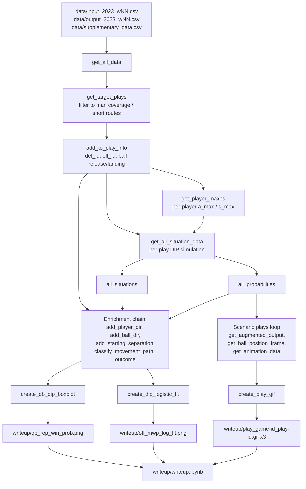

# Visual generation pipeline flowchart

Stage-by-stage flow of `code/main.py`, which regenerates the reproducible
visuals referenced by `writeup/writeup.ipynb`.

Note: the hand-made full-play GIFs (`cardinals_td.gif`, `houston_fourth_qtr_int.gif`,
`raiders_fourth_down_inc.gif`) and all `.mp4` files in `writeup/` are not produced by
this pipeline — there is no generator for them in the codebase.
